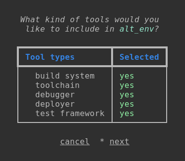

# Learn more: How to create a new Development Environment

You can create new Development Environments from containerized tools. The tool images can be 
present:

- locally: `dem list --local --tool`
- in registry: `dem list --all --tool`

As an example let's create another, alternative Environment for our target with the following
elements:

- Build system: [cmake](https://cmake.org/documentation/)
- Toolchain: [gnu-arm-none-eabi](https://gcc.gnu.org/onlinedocs/)
- Debugger and deployer: [stlink-org](https://github.com/stlink-org/stlink)
- Test environment: dummy test

### **Obtaining the cmake, gnu-arm-none-eabi and stlink-org tool images**

These tools are available in the axem registry. The cmake and GNU-arm-toolchain are present in the 
same container image alongside with make: `cmake_make_gnu-arm`.
The stlink-org has its own image: `stlink_org`.

### **Obtaining the dummy test tool image**

You can use your own tools that you containerized by yourself in Development Environments created 
with DEM. To see how to do it, we containerize a dummy test tool. (This won't be an actual test 
environment, just a script that prints "test environment" :face_with_hand_over_mouth:.)

Let's create a directory for building the dummy test tool!

    mkdir dummy_test
    cd dummy_test

Create a shell script that will run inside the container.

``` sh title="dummy_test.sh"
#!/bin/sh

echo "test environment"
```

Set the dummy_test.sh, file to be executable.

    chmod +x dummy_test.sh

Create a file called `Dockerfile` (without extension) that describes how to build this dummy image.

``` title="Dockerfile"
FROM debian:latest

WORKDIR /work
ADD dummy_test.sh /work
```

Build the Docker container image.

    docker build -t dummy_test:latest .

Now run the script inside a container to ensure everything works as expected.

    docker run dummy_test /bin/sh -c "./dummy_test.sh"

### **Create the new Environment**

To start the interactive Development Environment creation you need to use the `dem create` command. 

    dem create alt_env

You will see the available tool types. Select all of them with :material-keyboard-space:.



Select *next* when you finished. 

Next, you will go through all the selected tool types one-by-one and you can select the required tool
image for all of them, by pressing :material-keyboard-return:.

- build system: `axemsolutions/cmake_make_gnu-arm:latest`
- toolchain: `axemsolutions/cmake_make_gnu-arm:latest`
- debugger: `axemsolutions/stlink_org:latest`
- deployer:`axemsolutions/stlink_org:latest`
- test framework:`dummy_test:latest`

That's it! Now you have a new Development Environment.

## Share your new Development Environment

A very important feature of DEM is to provide a reliable way to share Development Environments. To 
make every member of an organization use the same toolset, the best way is to provide the 
Development Environment from a catalog.  
If you would like to share your Development Environment with someone directly, DEM has your back! 
A Development Environment descriptor can be exported to a file in JSON format, which then can be loaded to another host. 

!!! note

    The exported file only contains the Development Environments descriptor in JSON format. The 
    other host needs access to all required registries for successful installation.

If you'd like to share the newly created alt_env, first export it:

    dem export alt_env alt_env.json

This will create the alt_env.json file in your current directory.  
On the other host, the Development Environment descriptor can be loaded:

    dem load alt_env.json